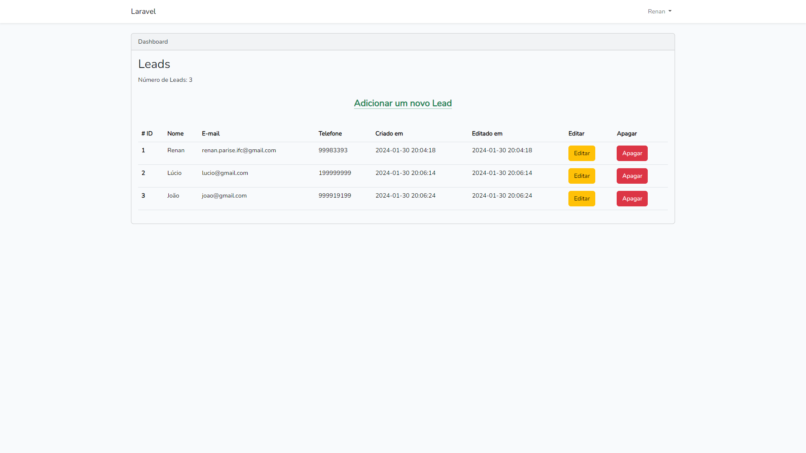
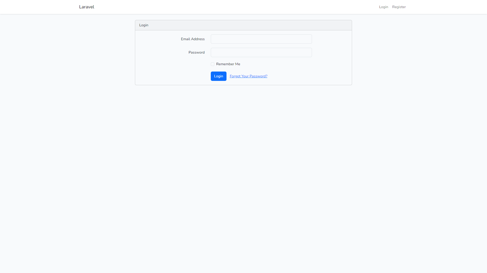
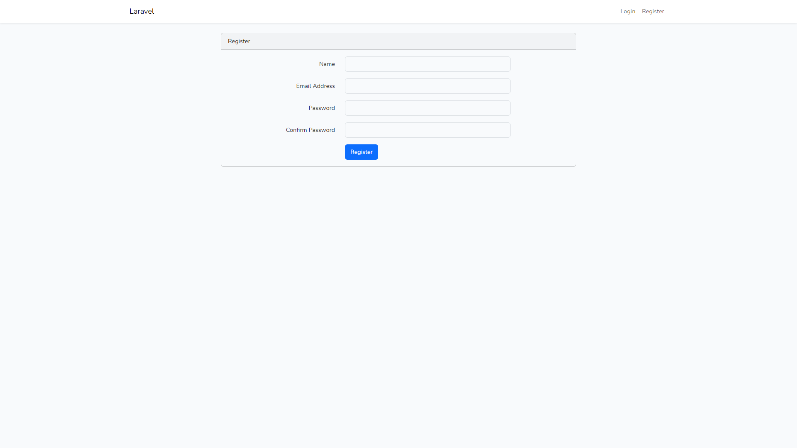
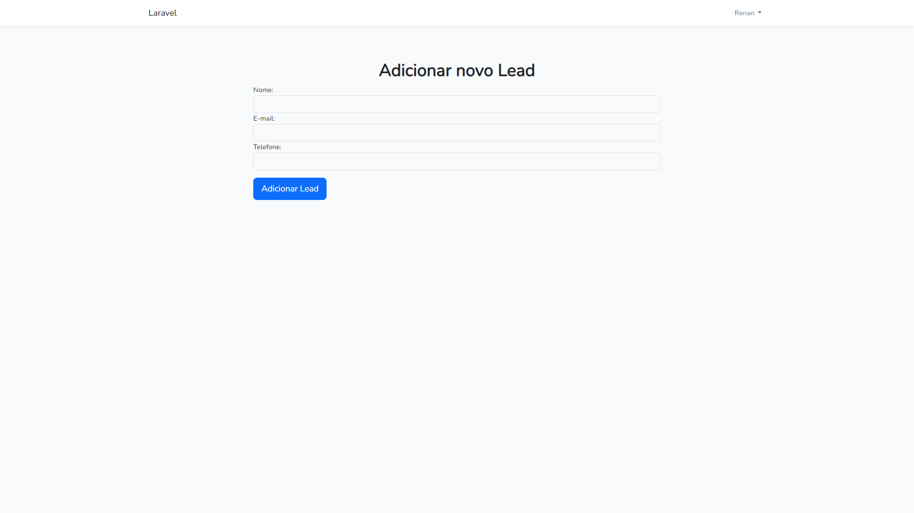
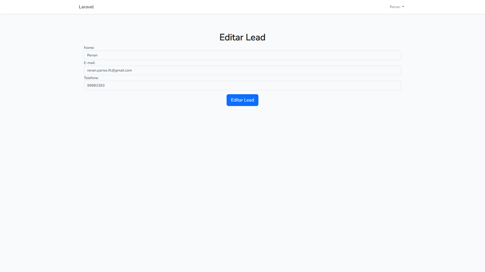

# LaraLeads

Este repositório contém o código-fonte do projeto LaraLeads, um aplicativo feito com PHP (Laravel), MySQL e Bootstrap. Foi desenvolvido para o teste prático de uma vaga Back-End.

O LaraLeads ossui funções de autenticação e a possibilidade de gerenciar Leads. Também conta com testes unitários e de integração.

## Configuração e Execução

1. **Clone o Repositório:**
    ```bash
    git clone https://github.com/Renan-Parise/laraleads.git
    ```

2. **Renomeie o Arquivo `.env.example`:**
   - Renomeie o arquivo `.env.example` para `.env`.
   - Insira as informações do seu banco de dados no arquivo `.env`.

3. **Crie as Databases:**
    ```bash
    php artisan migrate
    ```

4. **Inicie o Servidor PHP:**
    ```bash
    php artisan serve
    ```
   O aplicativo estará disponível em [http://localhost:8000](http://localhost:8000).

5. **Atualize as Dependências com Composer:**
    ```bash
    composer update
    ```

6. **Execute os Testes PHPUnit:**
    ```bash
    ./vendor/bin/phpunit
    ```

   Certifique-se de que todos os testes passem com sucesso.

## Imagens do Programa







Estas imagens representam a interface do programa. Para obter uma experiência completa, siga as etapas acima e explore o LaraLeads.