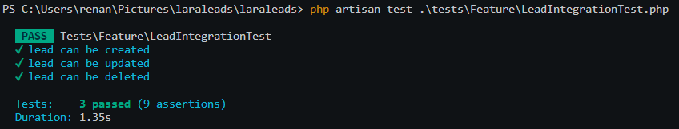
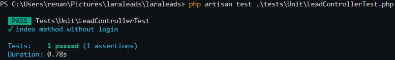

# LaraLeads

Este repositório contém o código-fonte do projeto LaraLeads, um aplicativo feito com PHP (Laravel), MySQL e Bootstrap, usando a arquitetura MVC. Foi desenvolvido para o teste prático de uma vaga Back-End.

O LaraLeads ossui funções de autenticação e a possibilidade de gerenciar Leads. Também conta com testes unitários e de integração.

## Configuração e Execução

1. **Clone o Repositório:**
    ```bash
    git clone https://github.com/Renan-Parise/laraleads.git
    ```

2. **Renomeie o Arquivo `.env.example`:**
   - Renomeie o arquivo `.env.example` para `.env`.
   - Insira as informações do seu banco de dados no arquivo `.env`.

3. **Crie as Databases:**
    ```bash
    php artisan migrate
    ```

4. **Atualize as Dependências com Composer:**
    ```bash
    composer update
    ```

5. **Inicie o Servidor PHP:**
    ```bash
    php artisan serve
    ```
   O aplicativo estará disponível em [http://localhost:8000](http://localhost:8000).

6. **Execute os Testes:**
    ```bash
    php artisan test .\tests\Feature\LeadIntegrationTest.php
    php artisan test .\tests\Unit\LeadControllerTest.php   
    ```

   Você também pode ver as imagens do testes logo abaixo.

## Imagens dos Testes




## Imagens do Programa


Estas imagens representam a interface do programa. Para obter uma experiência completa, siga as etapas acima e explore o LaraLeads.

7. **Requisitos do teste prático:**
    Front-End:
    ✅ Tela de login
    ✅ Crie uma interface de usuário responsiva para o sistema usando HTML, Bootstrap, CSS e JavaScript (jquery).
    ✅ Implemente a página de listagem dos leads com a capacidade de adicionar, editar e excluir registros.


    Back-End:
    ✅ Utilizar as ferramentas do Laravel de autenticação
    ✅ Desenvolva utilizando os padrões do framework Laravel e Implemente APIs para: Criar, ler, atualizar e excluir registros.


    Persistência de Dados:
    ✅ Utilize um banco de dados (MySQL) para armazenar informações.
    ✅ Modele as tabelas ou documentos necessários para representar essas entidades.


    Segurança:
    ✅ Implemente autenticação e autorização básicas para proteger as operações sensíveis do sistema.
    ✅ Certifique-se de que senhas sejam armazenadas de forma segura.


    Testes:
    ✅ Escreva testes unitários para as principais funcionalidades do sistema.
    ✅ Realize testes de integração para garantir que os componentes interajam corretamente.